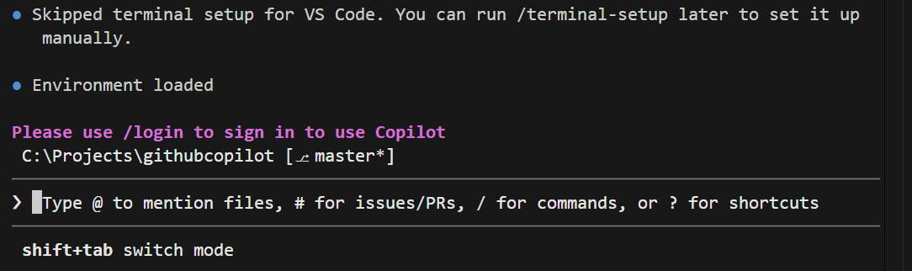

# scripts to execute to set up env
python -m venv myenv
Set-ExecutionPolicy RemoteSigned -Scope CurrentUser
myenv\Scripts\activate
pip install requests

# how to execute 
python .\learn-1.py <arg>

# To use github CLI
follow page https://docs.github.com/en/copilot/how-tos/copilot-cli/use-copilot-cli-agents/overview